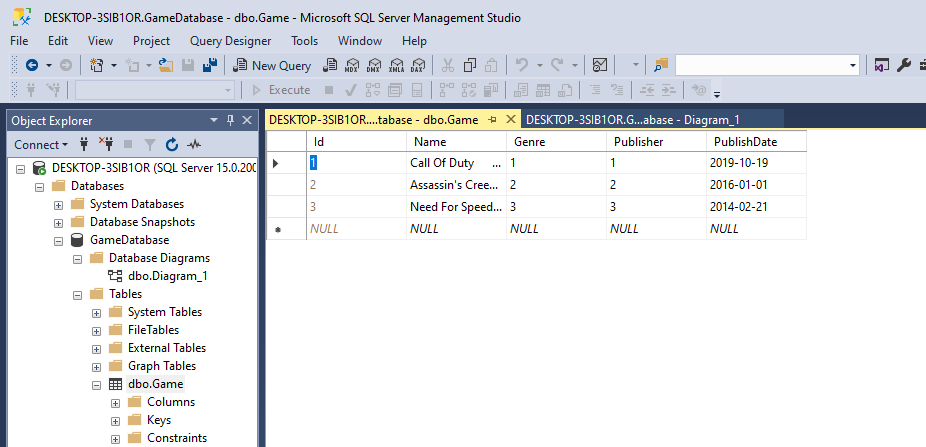
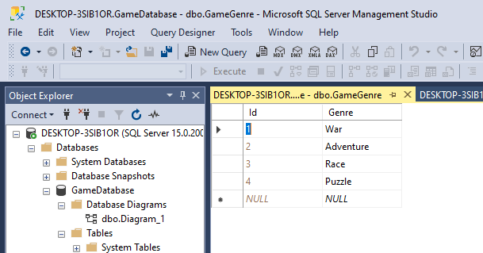
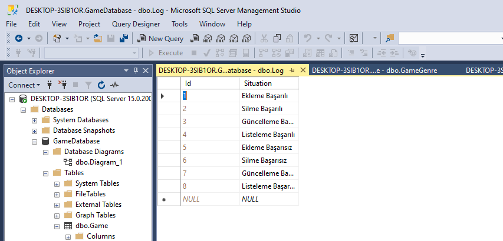
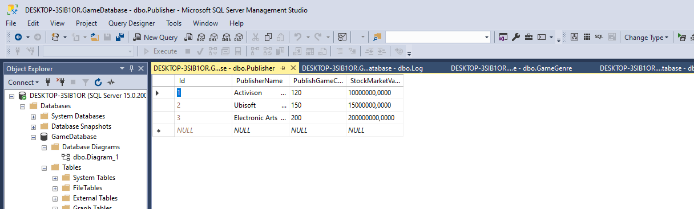
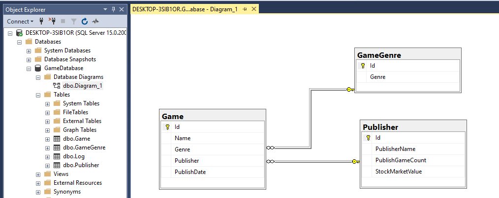
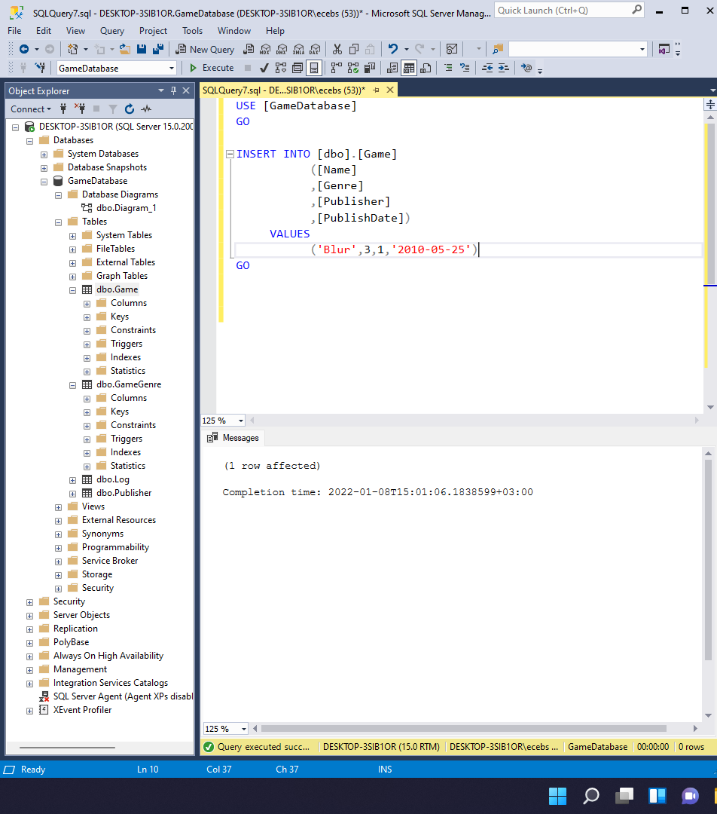
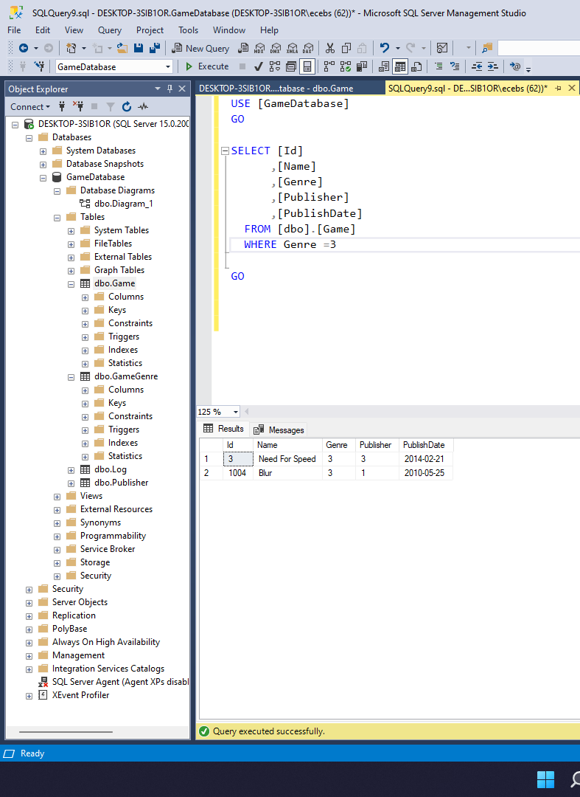
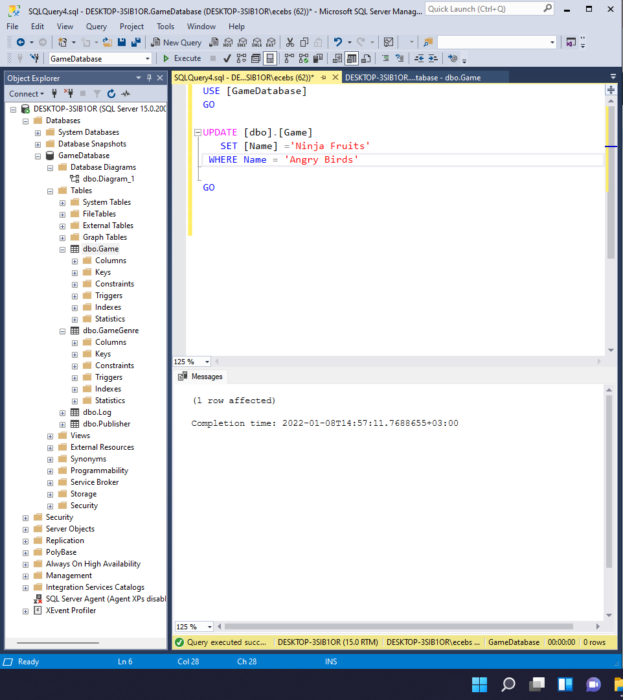
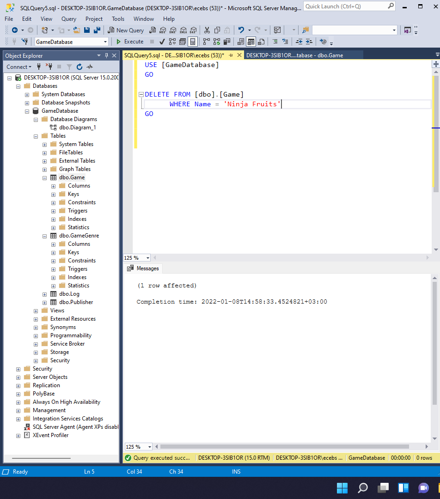

# Week 3
## Creating and Processing Tables in the Database

**1)** Create Tables And Diagram

---

**2)** İnsertion and Selection Operations

---

**3)**  Update Operation

---

**4)** Delete Operation

---

