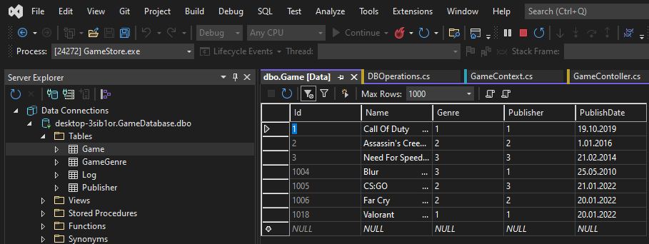

# Week 4
## CRUD Operations

**Please check the [Database Operations](https://github.com/AKBANK-Patika-FullStack-Bootcamp/EceBasturk_Homeworks/blob/master/Week4_GameStore/GameStore/Controllers/DBOperations.cs) and [Game Controller](https://github.com/AKBANK-Patika-FullStack-Bootcamp/EceBasturk_Homeworks/blob/master/Week4_GameStore/GameStore/Controllers/GameContoller.cs) classes.**

**Database**

---

**1)** Get Method

---

**2)** GetById Method

---

**3)** Post Method

---

**4)** Delete Method

---

**5)** Put Method 

